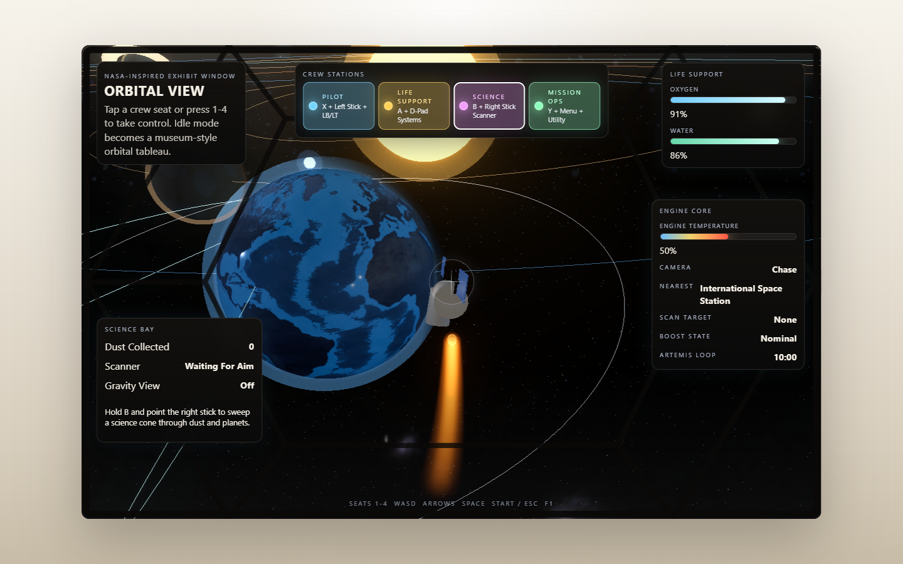

# Space Adventure

Four people, one museum cockpit, and a solar system that refuses to sit still.

[](docs/screenshots/orbital-cockpit.png)

Space Adventure is a locally runnable Three.js prototype for a children's museum exhibit. A player ship can free-fly across the solar system or escort a separate Artemis craft on its ten-minute loop around Earth and the Moon. Four crew stations divide the controls so a group can fly, protect the ship, scan the sky, and operate the mission together.

**Project state:** playable prototype · keyboard and Xbox controls · production build and automated smoke test included

## Try it

- **Live exhibit build:** <https://ijustcreate.github.io/space-adventure/>
- **Windows quick launch:** double-click `Launch_Space_Adventure.bat`
- **Local development:**

```powershell
npm install
npm run dev -- --host 127.0.0.1 --open
```

The launcher installs dependencies when needed and opens the local Vite server. A current Node.js LTS release is recommended.

## The exhibit loop

1. Take a crew seat by clicking it or pressing `1`–`4`.
2. Fly anywhere, follow Artemis, or explore a notable location.
3. Hand work between Pilot, Engineer, Scientist, and Communicator.
4. Pause safely, tune the exhibit, or let it return to its museum tableau.

When nobody is flying, the ship quietly remembers where home is.

## Crew stations

| Station | Xbox 360-style control | Keyboard | Responsibility |
| --- | --- | --- | --- |
| Pilot | `X` + left stick, `LB`/`LT` | `1` + `WASD`, `Shift`/`Ctrl` | Steer, boost, and brake the player ship |
| Life Support | `A` + D-pad | `2` + arrow keys | Watch oxygen, water, and engine temperature; cool the engine |
| Science | Hold `B` + right stick | Hold `3` + `IJKL` | Sweep a science cone through dust and gravitational targets |
| Mission Ops | `Y`, `Back`, `RB`, `RT` | `4`, `Space`, `C` | Scan, reveal constellations, and cycle notable targets |

Shared controls:

- `Start / Menu` or `Esc`: pause and resume
- `F1`: open the exhibit/debug window
- `F`: toggle fullscreen
- `P`: save the HUD layout
- `R`: reset the HUD layout

The debug window locks gameplay input while it is open, so tuning the exhibit cannot accidentally fly the ship. Selection, camera mode, pause state, crew occupancy, and scan target remain visible on the main display.

## What is in the prototype

- Separate Artemis and player spacecraft
- Ten-minute Artemis loop near Earth and the Moon
- Free-flight and escort-style exploration
- Museum and chase camera compositions with staff camera tuning
- Multi-seat keyboard, mouse, and controller input
- Staff HUD layout editor with persistent positions and scale
- World-space orbital wakes that make planetary motion legible
- Constellation overlays for Orion, the Big Dipper, and Cassiopeia
- Notable targets including the ISS, Hubble, JWST, and both Voyagers
- Pause, fullscreen, idle-return, collision, and attract-mode behavior
- A floating staff/debug window with camera and exhibit tuning

## Build and verify

```powershell
npm ci
npm run build
npm run preview
```

With the development server running at `http://127.0.0.1:5173`, run the included browser smoke test:

```powershell
npm run smoke -- http://127.0.0.1:5173
```

The smoke flow checks all four crew stations, Life Support cooling, the Science scanner, ship input, HUD editing, pause behavior, collision response, modal input locking, and representative screenshots. Generated builds, logs, and smoke artifacts stay local and are excluded from Git.

## Project map

```text
src/
  game/
    SpaceAdventureApp.js   Scene, simulation, exhibit UI, and game state
    InputManager.js        Keyboard and controller abstraction
    content.js             Labels, locations, and exhibit copy
  main.js                  Browser entry point and test hooks
  style.css                Exhibit presentation
public/textures/           Earth, Moon, and Milky Way texture set
tools/smoke_test.mjs       Playwright verification flow
Space_Adventure_GDD.md     Original design and interaction brief
```

The app exposes `window.render_game_to_text()` and `window.advanceTime(ms)` for deterministic browser verification.

## Hosting

GitHub Actions builds the Vite project and deploys `dist/` to GitHub Pages. The repository keeps only source, selected documentation, and required assets; generated `dist/`, `output/`, logs, and dependencies are ignored.

## Content and project status

This remains a prototype rather than a finished or safety-certified museum installation. Test the actual display, controller, browser, audio environment, and idle recovery before exhibit use.

Surface textures are locally prepared from NASA-labelled Earth, Moon, and Milky Way source imagery. Preserve the source files and review the applicable source-use and attribution requirements before redistributing them in another product.

No project license has been declared.
